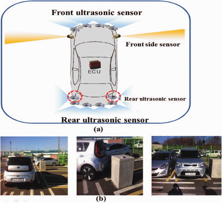

# Embedded Parking Assist

## Description
Modern cars are often outfitted with a parking assist system that consists of a set of ultrasonic or electromagnetic sensors around the car body that provides the driver with 360-degree proximity information. These systems provide timely warnings for obstacles when parking and significantly reduce backover crashes when used correctly (Keall, 2017). While these sensors have existed for considerable time, fully automatic parking assist systems (APASs) which employ these sensors to park the car automatically still face issues conserving onboard CPU bandwidth (Song, 2016). This project aims to build a lightweight simulation of the component proximity sensors’ firmware in C++ that could potentially be ported into a small embedded system for further integration into an APAS system. The project will be managed in an Agile Scrum framework.



## Installation
This can be compiled on any c++11 compiler. Tested with Macbook Air M2's gcc compiler.

While in this repo folder, run:

```
g++ -Wall -std=c++17 -o embedded_parking_assist main.cpp Sensor.cpp -pthread
```

## Usage
Once compiled, run with:
```
./embedded_parking_assist
```

## Works Cited
Keall, M. D., Fildes, B., & Newstead, S. (2017). Real-world evaluation of the effectiveness of reversing camera and parking sensor technologies in preventing backover pedestrian injuries. Accident Analysis & Prevention, 99, 39-43.

Song, Y., & Liao, C. (2016, July). Analysis and review of state-of-the-art automatic parking assist system. In 2016 IEEE International Conference on Vehicular Electronics and Safety (ICVES) (pp. 1-6). IEEE.

